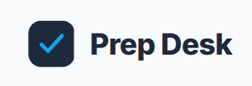
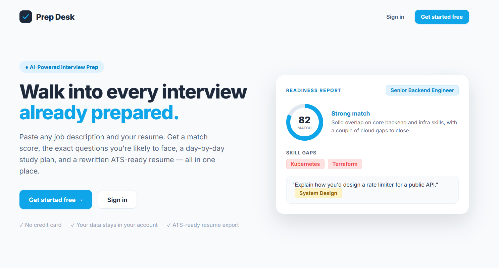
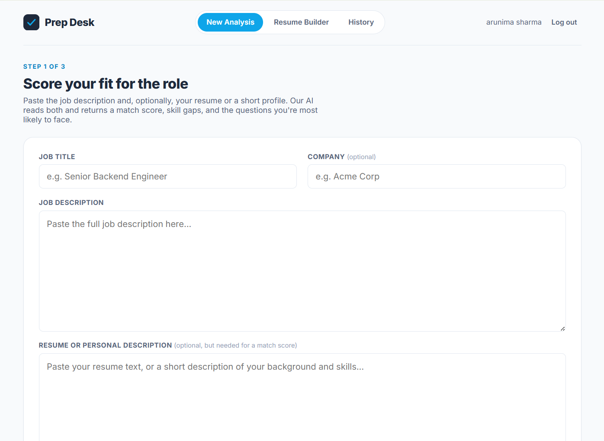
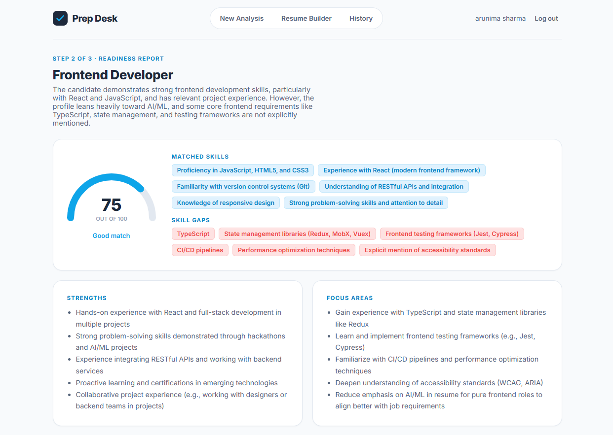
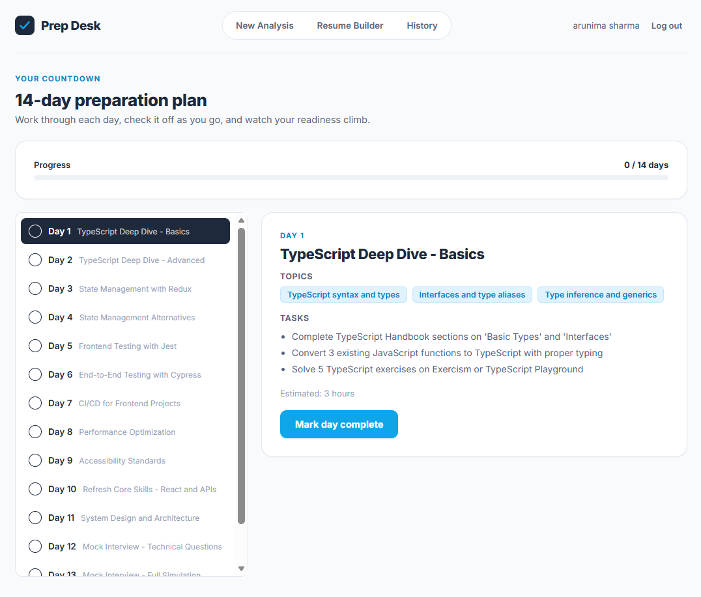
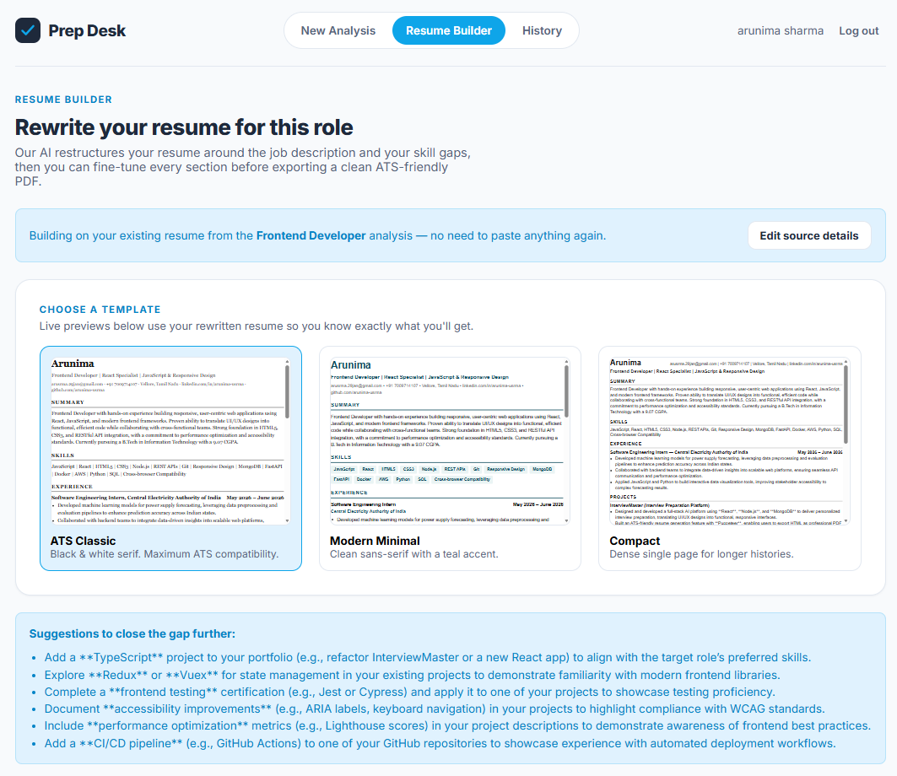
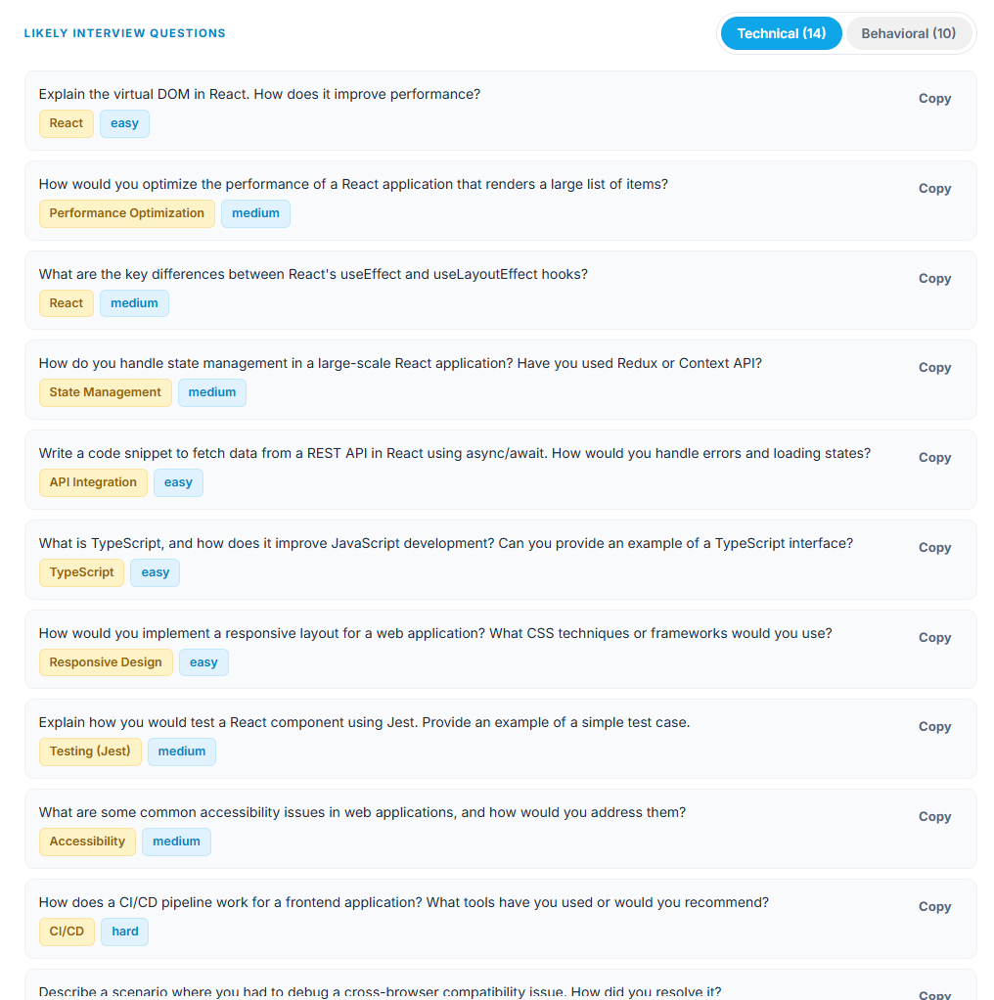
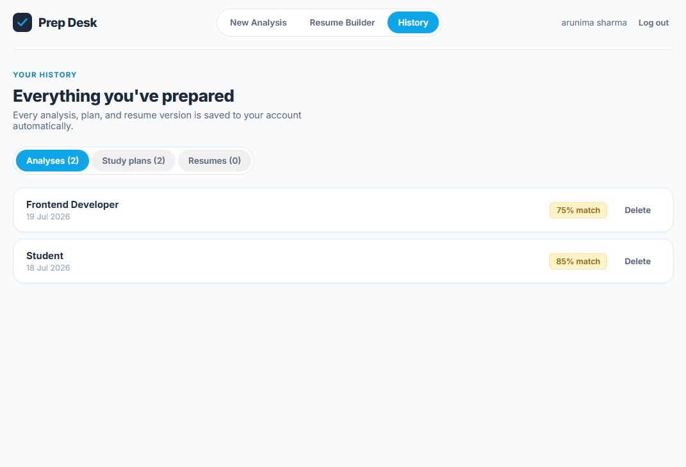
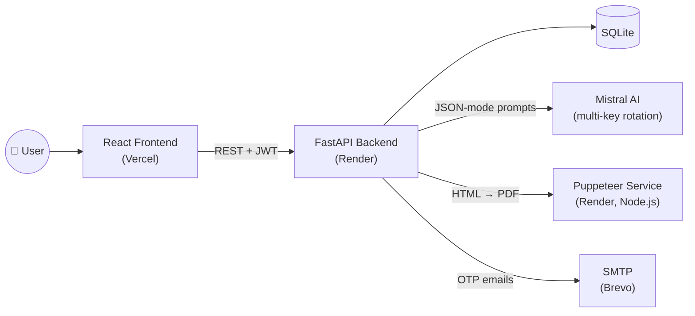

<div align="center">



# Prep Desk

### AI-powered interview readiness — score your fit, know the questions, follow the plan, ship the resume.

<p>
  <a href="https://your-project.vercel.app"><strong>🔗 Live Demo</strong></a>
  ·
  <a href="#-features">Features</a>
  ·
  <a href="#-screenshots">Screenshots</a>
  ·
  <a href="#-tech-stack">Tech Stack</a>
  ·
  <a href="#-getting-started-local-development">Run it locally</a>
</p>

<p>
  
  
  
  
  
  
  
  
</p>

</div>

<br/>

<div align="center">
  
  
</div>

<br/>

## Why I built this

Job hunting means juggling five different tools: one tab to check if you're even qualified, another
for practicing questions, a spreadsheet for a study plan, and a separate resume for every application.
**Prep Desk** puts all of it in one place — paste a job description and your resume, and it tells you
exactly how you stack up, what you'll be asked, how to spend the days you have left, and rewrites your
resume to match the role, with a live preview before you download it.

Everything runs on a real production stack — FastAPI, a Mistral-powered LLM pipeline with automatic
multi-key failover, JWT + email-OTP auth, and server-side PDF rendering via headless Chrome — not a
toy prototype.

---

## ✨ Features

| | |
|---|---|
| 🎯 **Instant match score** | Paste a JD + resume → get a 0–100 fit score with a plain-English breakdown, matched skills, and skill gaps |
| ❓ **Tailored interview questions** | 10+ technical and behavioral questions generated from the *actual* JD and *your* specific gaps — not a generic bank |
| 📅 **Day-by-day study plan** | Tell it how many days you have left → get a prioritized plan with a built-in progress tracker |
| 📄 **ATS resume rewrite** | Reuses the resume you already uploaded — no re-pasting. Tuned to fill exactly one A4 page, never fabricates experience |
| 👀 **Live template preview** | See all 3 resume templates rendered with your real content before picking one, plus a full preview before download |
| 🔐 **Real auth, not a toy login** | Email OTP verification on signup, JWT sessions, OTP-based password reset |
| 🗂️ **Full history** | Every analysis, plan, and resume version saved to your account |
| ⚡ **Multi-key AI failover** | Configure multiple Mistral API keys — requests auto-rotate and fail over on rate limits |

---

## 📸 Screenshots
<table>
<tr>
<td width="50%">

**Landing page**


</td>
<td width="50%">

**Readiness report** — score, gaps, questions


</td>
</tr>
<tr>
<td width="50%">

**Study plan** with progress tracker


</td>
<td width="50%">

**Resume builder** — templates + live preview


</td>
</tr>
<tr>
<td width="50%">

**Question Suggestions** - likely technical and behavorial question set


</td>
<td width="50%">

**History** — easy to access all past analysis


</td>
</tr>
</table>


## 🛠 Tech Stack

**Frontend** — React 19 + Vite, no UI framework (hand-styled), React Router
**Backend** — FastAPI, SQLAlchemy + SQLite, JWT auth, Jinja2
**AI** — Mistral AI (JSON-mode structured outputs, multi-key rotation/failover)
**PDF generation** — Node.js + Puppeteer (headless Chrome), server-rendered HTML → PDF
**Email** — SMTP (OTP verification + password reset), tested with Brevo's free tier
**Deployed on** — Vercel (frontend) + Render (backend + PDF service)

---

## 🏗 Architecture



<details>
<summary><strong>📂 Full project structure</strong></summary>

```
interview-platform/
├── backend/
│   ├── app/
│   │   ├── main.py               FastAPI app, CORS, router registration
│   │   ├── config.py             Settings (Mistral keys, SMTP, JWT, etc.)
│   │   ├── database.py           SQLAlchemy engine/session
│   │   ├── models_db.py          User, Analysis, StudyPlan, Resume
│   │   ├── schemas.py            Pydantic request/response models
│   │   ├── auth.py               JWT + password hashing
│   │   ├── llm.py                Mistral client — multi-key rotation & failover
│   │   ├── services/
│   │   │   ├── analyzer.py       JD/resume match + question generation
│   │   │   ├── planner.py        Day-by-day study plan generation
│   │   │   ├── resume_ai.py      ATS resume rewrite (one-page-fill logic)
│   │   │   ├── pdf_render.py     HTML render → PDF (local or split-service mode)
│   │   │   ├── email_service.py  SMTP sending
│   │   │   └── otp_service.py    OTP generation/verification
│   │   ├── templates_resume/     3 HTML resume templates
│   │   └── routers/              auth, analyze, plan, resume endpoints
│   └── pdf_service/
│       ├── generate_pdf.js       CLI mode (local subprocess)
│       ├── server.js             HTTP mode (split deployment, e.g. Render)
│       └── pdf_lib.js            Shared Puppeteer rendering logic
├── frontend/
│   └── src/
│       ├── lib/api.js            Fetch wrapper with JWT auth
│       └── components/           Landing, AuthPage, AnalysisResult,
│                                  PlanView, ResumeBuilder, History, ...
├── DEPLOYMENT.md                 Full deployment guide (3 paths)
└── screenshots/                  ← your images go here
```

</details>

---

## 🚀 Getting Started (local development)

**Prerequisites:** Python 3.10+, Node.js 18+, a [Mistral API key](https://console.mistral.ai/), and
SMTP credentials for OTP emails ([Brevo](https://www.brevo.com)'s free tier works well — 300 emails/day, no card required).

```bash
# 1. Backend
cd backend
python3 -m venv venv && source venv/bin/activate
pip install -r requirements.txt
cp .env.example .env   # fill in MISTRAL_API_KEY and SMTP_* — see table below
uvicorn app.main:app --reload --port 8000

# 2. PDF service (one-time)
cd backend/pdf_service && npm install

# 3. Frontend
cd frontend
npm install && cp .env.example .env
npm run dev
```

Open **http://localhost:5173**, register, check your inbox for the verification code, and go.

Full production deployment steps (Docker Compose, manual VPS, or Vercel+Render) are in
**[`DEPLOYMENT.md`](./DEPLOYMENT.md)**.

<details>
<summary><strong>Environment variables reference</strong></summary>

| Variable | Required | Notes |
|---|---|---|
| `MISTRAL_API_KEY` / `MISTRAL_API_KEYS` | **Yes** | Single key or comma-separated list for rotation/failover |
| `MISTRAL_MODEL` | No | Defaults to `mistral-large-latest` |
| `SMTP_HOST` / `PORT` / `USERNAME` / `PASSWORD` / `FROM_EMAIL` | **Yes** | Needed for OTP signup/reset emails |
| `CORS_ORIGINS` | No | Comma-separated allowed frontend origins |
| `JWT_SECRET` | No | Auto-generated if unset (set explicitly on ephemeral-disk hosts like Render free tier) |
| `DATABASE_URL` | No | Defaults to local SQLite; swap for Postgres if needed |
| `PDF_SERVICE_URL` / `PDF_SERVICE_TOKEN` | No | Only for split deployments (PDF renderer as its own service) |
| `VITE_API_URL` (frontend) | **Yes** | Where the frontend finds the backend API |

</details>

<details>
<summary><strong>API overview</strong></summary>

| Method & path | Purpose |
|---|---|
| `POST /api/auth/register` | Create account (unverified) — sends a 6-digit email code |
| `POST /api/auth/verify-otp` | Verify signup code → session token |
| `POST /api/auth/login` | Sign in — blocked with a clear message if unverified |
| `POST /api/auth/forgot-password` / `reset-password` | Email-code password reset |
| `POST /api/analyze` | JD + resume → match score, skills, questions |
| `POST /api/plan` | Generate a day-by-day study plan |
| `PATCH /api/plan/{id}/progress` | Mark a day complete |
| `POST /api/resume/improve` | AI-rewrite a resume for a target role |
| `POST /api/resume/preview` | Render resume JSON → HTML (live preview / template gallery) |
| `POST /api/resume/pdf` | Render resume JSON → downloadable PDF |

Full interactive docs at `/docs` on any running instance.

</details>

---

## 🗺 Roadmap

- [ ] Mock interview mode — timed Q&A with self-rating
- [ ] Editable saved resumes (currently view/download only)
- [ ] Company-specific question packs
- [ ] LinkedIn profile import
- [ ] Analytics dashboard — match-score trends across applications
- [ ] Streaming AI responses

---

## 👩‍💻 Author

**Arunima**
<!-- Add your links: -->
<!-- [Portfolio](https://your-portfolio.com) · [LinkedIn](https://linkedin.com/in/you) · [GitHub](https://github.com/you) -->

<div align="center">
<sub>Made with ❤️ by Arunima</sub>
</div>
